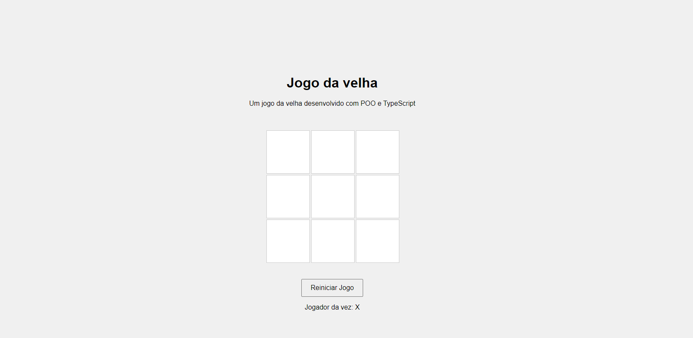

# Documentação do Jogo da Velha (Tic Tac Toe)

A seguir está a descrição da implementação de um jogo da velha (Tic-Tac-Toe) usando TypeScript (OOP- object oriented programming), HTML e CSS. O jogo permite que dois jogadores joguem alternadamente até que um ganhe ou o jogo termine em empate. A interface do usuário é criada com HTML e estilizada com CSS. Também inclui testes unitários utilizando Jest.

## Rodando os arquivos do jogo

Para rodar os arquivos do jogo da velha confira os seguintes passos:

- Baixe o repositorio "tictactoe" em um lugar de sua preferencia;
- Digitar o seguinte comando no terminal para instalar todas as dependencias do repositório:

```bash
    npm install
```

- Após isso, basta digitar o seguinte comando no terminal para rodar o jogo e  realizar a "build" dos arquivos TypeScript em JavaScript com o Webpack, em que o arquivo index.html irá carregar o JavaScript:

```bash
    npm run dev
```

- Caso queira realizar os teste unitarios com o jest, basta digitar o seguinte comando no terminal:

```bash
    npm test
```

- Para jogar o jogo, é necessário abrir o arquivo "index.html" ou utilizar a extensão "Live Server" do VS Code. Para acessar a versão que está funcionando atualmente, basta abrir o console do navegador (atalho F12 do teclado) enquanto estiver na página do jogo e começar a jogar.

 No momento a interface não está funcional

## Estrutura do Projeto

- `index.html`: Arquivo HTML contendo a estrutura do jogo.
- `styles.css`: Arquivo CSS para estilizar a interface do jogo.
- `index.ts`: Esse arquivo importa a classe TicTacToe de um módulo externo e cria uma nova instância do jogo, iniciando uma partida com o método startGame().
- `tictactoe.ts`: Este arquivo define a classe TicTacToe, que gerencia o jogo da velha, incluindo a inicialização do tabuleiro e dos jogadores, o controle das jogadas, a verificação de vitórias ou empates, e a configuração de controles de teclado para interagir com o jogo.
- `player.ts`: Este arquivo define a classe Player que representa um jogador no jogo da velha, gerenciando o símbolo atual do jogador (X ou O), permite obter o símbolo atual, alternar entre os símbolos e reiniciar o jogador para o símbolo inicial (X).
- `board.ts`: Este arquivo define a classe Board que representa o tabuleiro do jogo da velha, permitindo criar um tabuleiro vazio, registrar jogadas, verificar se o tabuleiro está cheio, imprimir o estado atual do tabuleiro e checar se um jogador venceu com base nos padrões de vitória.
- `index.test.ts`: Arquivo de teste para o jogo usando Jest (https://jestjs.io/).

## index.html

O arquivo `index.html` define a estrutura básica da interface do jogo da velha. 

### Estrutura do HTML

- **`<div class="game-container">`**: Contém todo o conteúdo do jogo.
  - **`<div id="board">`**: Representa o tabuleiro do jogo, composto por 9 células.
    - **`<div class="cell" data-row="x" data-col="y"></div>`**: Cada célula do tabuleiro é representada por um div com as classes `cell`, e atributos `data-row` e `data-col` que indicam a posição da célula no tabuleiro.
  - **`<button id="resetButton">Reiniciar Jogo</button>`**: Botão para reiniciar o jogo.
  - **`<p id="currentPlayer">Jogador da vez: X</p>`**: Parágrafo que exibe o jogador atual.

## styles.css

O arquivo `styles.css` estiliza a interface do jogo, garantindo que o tabuleiro e os elementos do jogo sejam visualmente agradáveis e fáceis de usar.

### Estilos Principais

- **Body**: Centraliza o conteúdo da página e define um fundo cinza claro.

- **Game Container**: Centraliza o conteúdo do jogo e define o alinhamento do texto.

- **Board**: Cria uma grade 3x3 com células de 100px de largura e altura, com um espaçamento de 5px entre elas.

- **Cell**: Define o estilo das células do tabuleiro, incluindo tamanho, centralização do texto, bordas e efeitos de hover.

- **Reset Button**: Estiliza o botão de reinício do jogo.

## index.ts

### Métodos Principais

- **`initialize()`**: Inicializa os eventos para teclas e cliques.
- **`handleKeyPress(event: KeyboardEvent)`**: Lida com eventos de teclas.
- **`handleCellClick(event: Event)`**: Lida com eventos de cliques nas células.
- **`play(row: number, col: number)`**: Executa uma jogada.
- **`checkWin(player: string)`**: Verifica se um jogador venceu.
- **`isBoardFull()`**: Verifica se o tabuleiro está cheio.
- **`resetGame()`**: Reinicia o jogo.

## index.ts

### Métodos Principais

- **`TicTacToe()`**: Construtor da classe que inicializa o jogo da velha, criando um novo tabuleiro e um jogador.
- **`startGame()`**: Inicia uma nova partida, redefinindo o tabuleiro e o jogador, e exibe o estado inicial do jogo.

## tictactoe.ts

### Métodos Principais

- **`constructor()`**: Inicializa uma nova instância do jogo da velha, criando um tabuleiro e um jogador, e configurando os controles de teclado.
  
- **`startGame(): void`**: Reinicia o jogo, redefinindo o tabuleiro e o jogador, e exibe o estado inicial do jogo.

- **`handleMove(row: number, col: number): void`**: Processa uma jogada, atualizando o tabuleiro e verificando se houve uma vitória ou empate.

- **`initializeKeyboardControls(): void`**: Configura os controles de teclado para permitir que os jogadores façam jogadas e reiniciem o jogo.

## player.ts

### Métodos Principais

- **`constructor()`**: Inicializa uma nova instância do jogador, definindo o símbolo inicial como 'X'.

- **`reset(): void`**: Reinicia o jogador, redefinindo o símbolo atual para 'X'.

- **`getCurrentPlayer(): string`**: Retorna o símbolo do jogador atual ('X' ou 'O').

- **`switchPlayer(): void`**: Alterna o símbolo do jogador atual entre 'X' e 'O'.

## board.ts

### Métodos Principais

- **`constructor()`**: Inicializa uma nova instância do tabuleiro, criando um tabuleiro vazio.

- **`createEmptyBoard(): string[][]`**: Cria e retorna um tabuleiro vazio (3x3) representado por uma matriz de strings.

- **`reset(): void`**: Reinicia o tabuleiro, redefinindo-o para um estado vazio.

- **`getBoard(): string[][]`**: Retorna o estado atual do tabuleiro.

- **`setMove(row: number, col: number, player: string): boolean`**: Registra uma jogada no tabuleiro na posição especificada, se for válida e não estiver ocupada, retornando `true` se a jogada for bem-sucedida e `false` caso contrário.

- **`isFull(): boolean`**: Verifica se o tabuleiro está cheio, retornando `true` se não houver mais espaços disponíveis.

- **`print(): void`**: Imprime o estado atual do tabuleiro no console.

- **`checkWin(player: string): boolean`**: Verifica se o jogador especificado venceu, retornando `true` se houver uma combinação vencedora.

## Testes

### index.test.ts

Os testes em Jest garantem que a funcionalidade do jogo esteja correta, incluindo o comportamento do tabuleiro, alternância de jogadores, detecção de vitórias e empates, e a reinicialização do jogo. A seguir está a descrição de cada teste que é feito.

### Descrição dos Testes

1. **Deve começar com um tabuleiro vazio**:
   - Verifica se o tabuleiro inicial está vazio após a inicialização do jogo.
   
2. **Deve começar com o jogador X**:
   - Verifica se o jogador inicial é o 'X' após a inicialização do jogo.
   
3. **Deve colocar uma marca no "tabuleiro"**:
   - Verifica se uma jogada coloca a marca correta ('X') no tabuleiro na posição especificada.
   
4. **Deve trocar de jogador após uma jogada**:
   - Verifica se o jogador atual alterna entre 'X' e 'O' após cada jogada.
   
5. **Verifica se o jogo não permite que um jogador faça uma jogada em um espaço já ocupado**:
   - Garante que uma célula ocupada não pode ser jogada novamente pelo jogador atual.
   
6. **Deve detectar uma vitória em linha**:
   - Verifica se o jogo detecta corretamente uma vitória em linha para o jogador 'X'.
   
7. **Deve detectar uma vitória em uma coluna**:
   - Verifica se o jogo detecta corretamente uma vitória em coluna para o jogador 'X'.
   
8. **Deve detectar uma vitória em uma diagonal**:
   - Verifica se o jogo detecta corretamente uma vitória em diagonal para o jogador 'X'.
   
9. **Deve detectar um empate**:
   - Verifica se o jogo detecta corretamente um empate quando o tabuleiro está cheio e nenhum jogador venceu.
   
10. **Deveria resetar o jogo**:
    - Verifica se o jogo reinicia corretamente, limpando o tabuleiro e resetando o jogador atual para 'X'.
    
11. **Verifica se o jogo está reagindo corretamente ao pressionamento de uma tecla específica**:
    - Testa se o jogo processa corretamente uma jogada feita por meio do pressionamento da tecla 'q', correspondente à posição (0, 0) no tabuleiro.
    
12. **O jogo está alternando corretamente entre os jogadores "X" e "O" após a pressão de teclas específicas**:
    - Verifica se o jogo alterna corretamente entre os jogadores 'X' e 'O' quando as jogadas são feitas por meio das teclas 'q' (posição 0, 0) e 'w' (posição 0, 1).